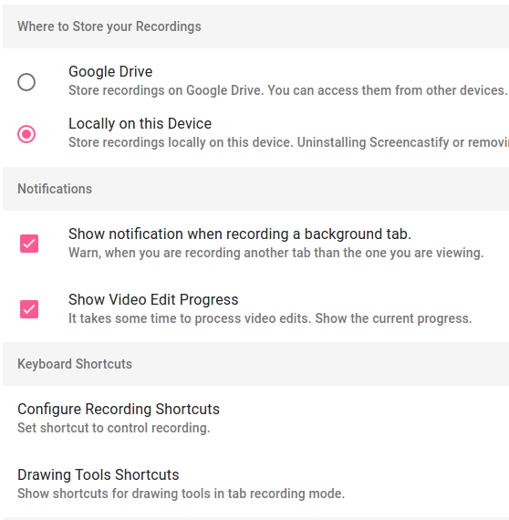
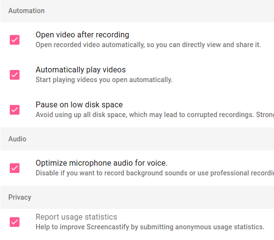

# Configurando las opciones

Accediendo a "Options", podemos ver en primer lugar dónde se guardan nuestros vídeos (Where to Store your Recordings). Como ya vimos, elegimos bien Google Drive o bien en nuestro disco duro. 

A configuramos qué información nos da durante la grabación (Notifications) y los accesos de teclado las funciones y las herramientas (Keyboard Shortcuts). Por defecto, vienen unas, pero podemos configurarlas a nuestro gusto.

También están aquí las acciones automáticas que se ejecutan al terminar de grabar. En este apartado es recomendable dejar solo activada la pausa de grabación cuando tenemos el disco lleno, que es la tercera, ya que las otras dos son  bastante molestas en caso de que estemos haciendo más de una grabación, porque según terminas, se abre la grabación y se reproduce.

Por último, una casilla de optimización del audio para micro si utilizamos la grabación para hacer un tutorial. Esto sería súper importante tenerlo activado en caso de que estemos haciendo un tutorial de vídeo.

También tenemos las estadísticas de uso, donde nos pregunta si queremos enviar informes a Google sobre el programa. Se hace de forma anónima y es para que la compañía vea si el programa tiene fallos y se para o deja de funcionar en algún momento, etc.

Con esto acabaríamos el apartado dedicado a Screencastify, un programa muy sencillito.

## ¿Quieres ver cómo se hace?

<iframe width="100%" height="350" style="display: block; margin-left: auto; margin-right: auto;" src="//www.youtube.com/embed/scuf-K8DOrk?rel=0" frameborder="0"></iframe>

