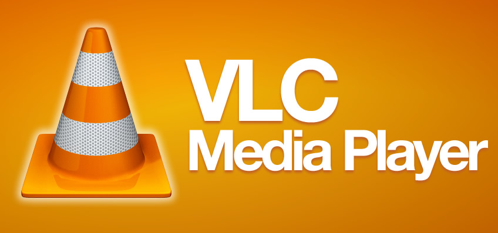
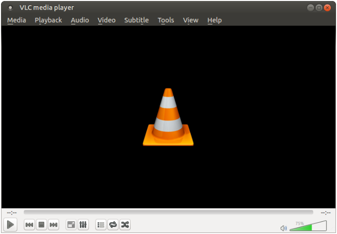
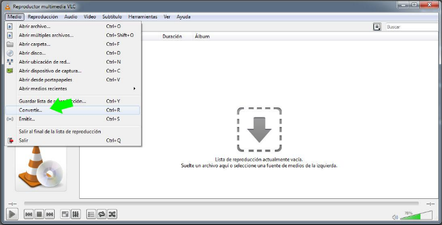
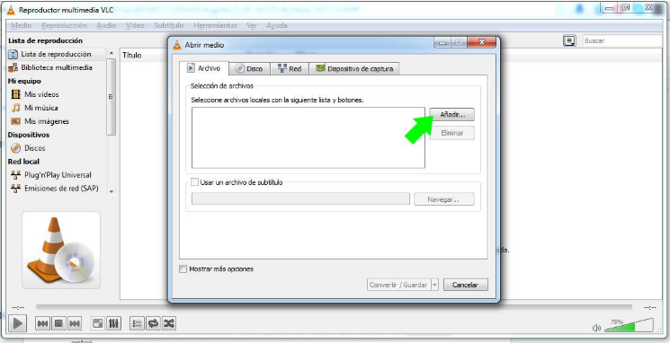
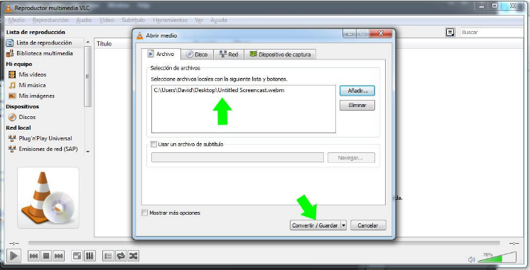
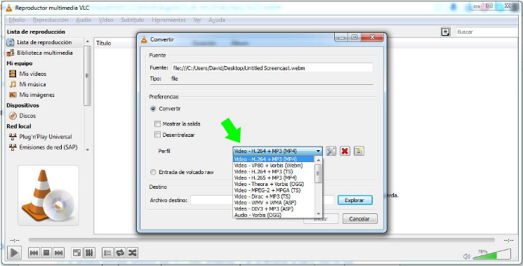
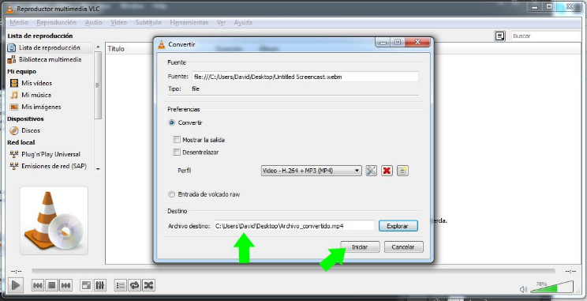
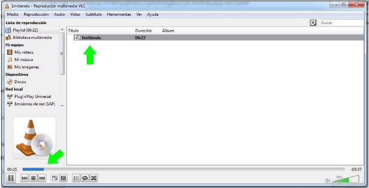

# Convertir archivos Screencastify con VLC

[VLC](http://www.videolan.org/vlc/) es un reproductor multimedia libre y de código abierto multiplataforma y un [framework](https://es.wikipedia.org/wiki/Framework) que reproduce la mayoría de archivos multimedia, así como DVD, Audio CD, VCD y diversos protocolos de transmisión. Reproduce virtualmente todo.

Además de ser un excelente reproductor, también puede convertir archivos. En este caso es un accesorio perfecto para combinar con Screencastify, pues puede convertir los archivos webM a mp4, por ejemplo.

**PASOS A SEGUIR.**

<li>
Abrimos VLC y en “medio”, buscamos “convertir”.
</li>

<li>
En la pestaña archivo le damos a Añadir.
</li>

<li>
Una vez lo tenemos cargado le damos a convertir/guardar.
</li>

En perfil tenemos diferentes formatos de salida. **Video MP4 codificado en H264 y con audio en MP3** es compatible con la mayoría de los sistemas de edición, por lo que puede ser una buena elección. No obstante lo ideal es que dependiendo del programa de edición que usemos nos cercioremos antes.

<li>
En Archivo de destino, pulsando explorar le damos la ruta donde queremos que aparezca el nuevo archivo convertido. Le damos un nombre y tras esto pulsamos iniciar.
</li>

En la ventana principal veremos que VLC está “emitiendo” y se va llenando la barra. El archivo está siendo convertido.

Y ya está, ya tendríamos el archivo en formato MP4

## ¿Quieres ver cómo se hace?
https://www.youtube.com/watch?v=y_ZJtUummLc

