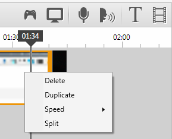
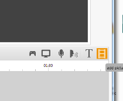
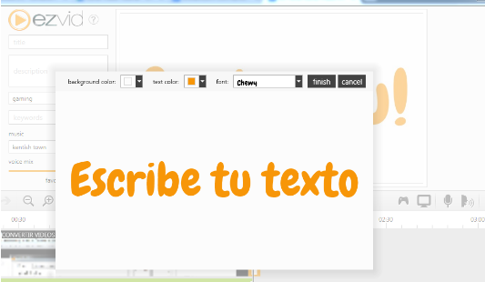
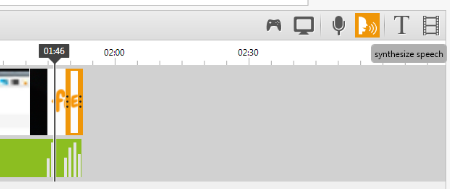
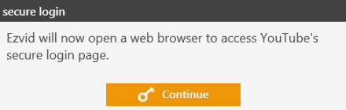
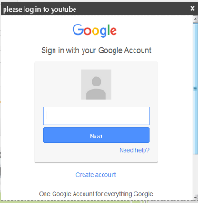
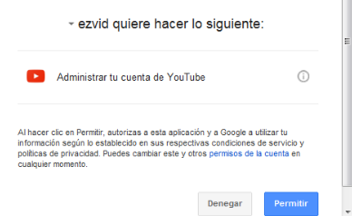

# Editando

Ezvid ofrece herramientas muy básicas de edición. Una vez grabada la pantalla nos devuelve a la pantalla principal, donde podremos empezar a editar nuestro vídeo.

Las opciones de edición que nos ofrece se abren con el botón derecho.

<li>
Borrar
</li>
<li>
Duplicar
</li>
<li>
Velocidad (de 25% a 600%)
</li>
<li>
Dividir
</li>

Duplicar

Dividir

Por otro lado, podemos también añadir fotografías y vídeos (botón add pictures or videos). A las fotografías se les aplica un efecto “ken burns” (zoom in).

También con la herramienta “T” (texto) podemos añadir textos, pero estos no se ponen sobre la imagen sino como un clip de vídeo. Además con Synthezise Speech podemos hacer que una voz creada digitalmente lea dicho texto (**el problema es que esto sólo funciona si escribimos en inglés**)

        

Una vez terminada nuestra edición pulsaremos sobre **Upload to Youtube.**

   

A partir de ahí tendremos que identificarnos con nuestro email de google para acceder a nuestra cuenta de youtube. Google nos pedirá permisos para que Ezvid pueda administrar nuestra cuenta de youtube y tras esto podremos realizar la subida.

