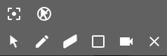
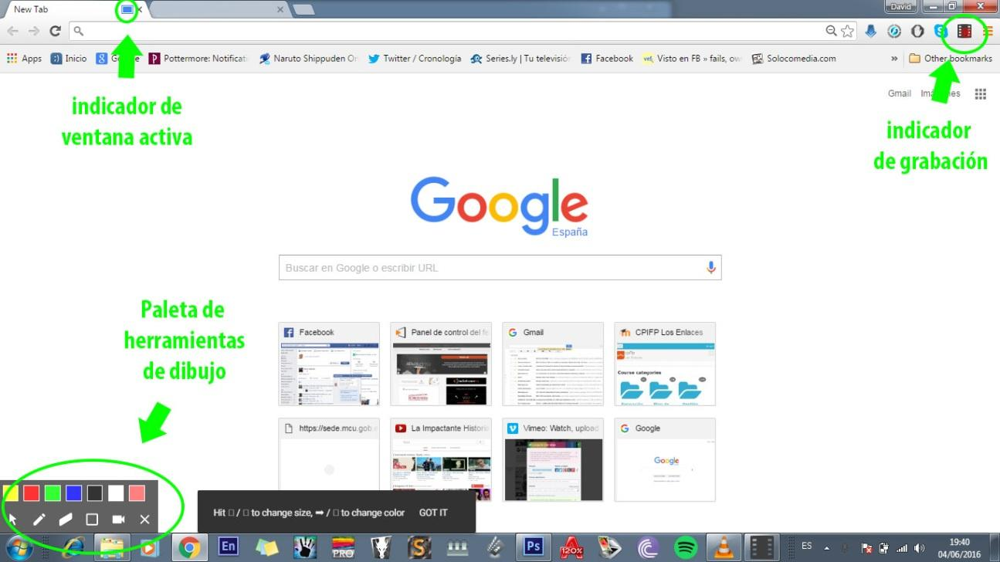
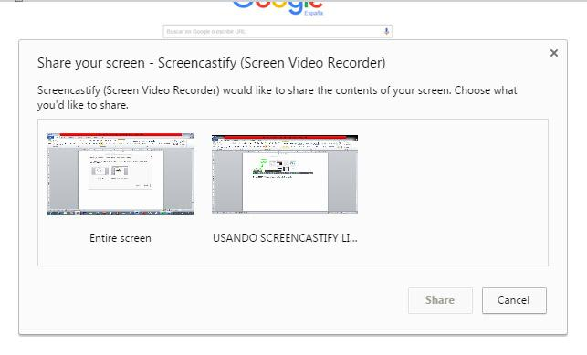
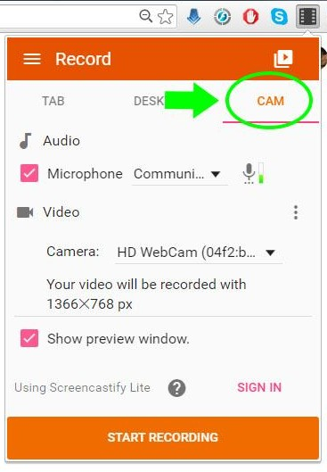
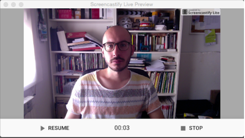
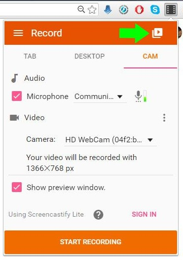
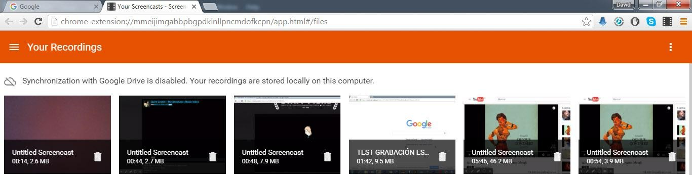
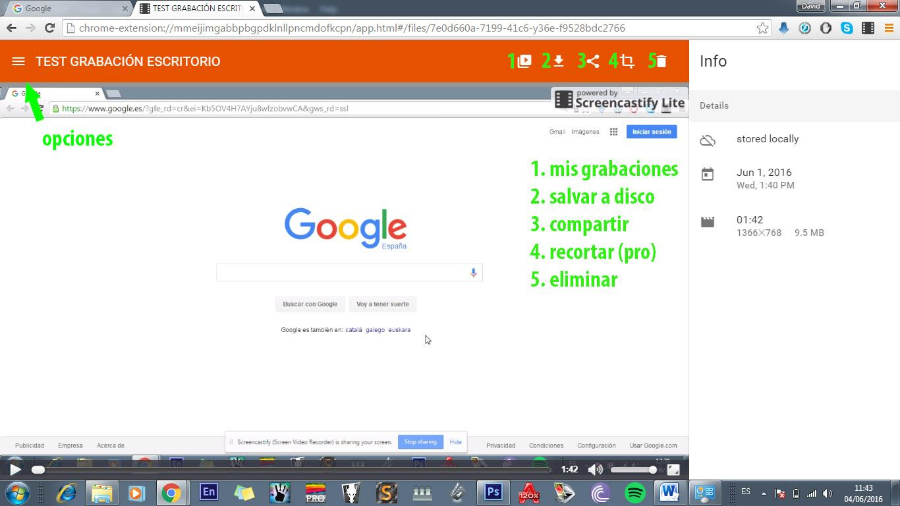
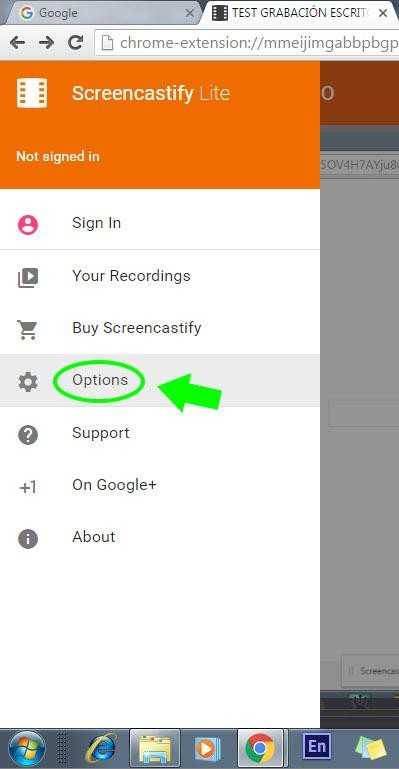

# Editando

Screencastify Lite es una versión gratuita del complemento de Google Chrome para capturar la pantalla, la webcam y el audio del sistema así como de la entrada de micrófono. Con él podremos grabar cualquier video que encontremos en Internet, crear un tutorial o grabarnos a través de la webcam, entre otras cosas.

La versión gratuita está limitada a la creación de clips de un máximo de 10 minutos.

Screencastify lite tampoco posee herramientas de montaje, por lo que a la hora de recortar el vídeo, unirlo a otros, añadir música, doblar el audio, etc. Tendremos que recurrir a otro programa, como por ejemplo el gratuito [OpenShot](https://www.google.com/url?q=http://www.openshotvideo.com/&amp;sa=D&amp;ust=1473070320425000&amp;usg=AFQjCNGr7P0BbmCX4X8bx91TdtfYM8S4bw).

Crea archivos .webm, [WebM](https://www.google.com/url?q=https://es.wikipedia.org/wiki/WebM&amp;sa=D&amp;ust=1473070320427000&amp;usg=AFQjCNFZQ3907vv-_ey7YZlq2QKP4ICZkQ) es un formato multimedia abierto y libre desarrollado por Google. Este formato no está aún muy extendido por lo que lo más recomendable en caso de que queramos editar un vídeo o crear una colección de vídeos en un único archivo será transcodificarlo (convertirlo) en un formato más habitual. Se explicará más adelante cómo realizar esa tarea con el programa [Videolan (VLC)](https://www.google.com/url?q=https://www.videolan.org/index.es.html&amp;sa=D&amp;ust=1473070320427000&amp;usg=AFQjCNFn1bG5PG5cgsAJ827Q57HEOMi37g) otro software gratuito.

A la hora de grabar la pantalla contamos con 3 modos diferentes: TAB (ventana) DESKTOP (escritorio) y CAM (Webcam)

**El modo TAB** nos permite grabar tanto el audio de nuestra entrada de micrófono como el audio de sistema (es decir todo el audio que salga por nuestros altavoces). Nos permite también insertar el vídeo proveniente de nuestra webcam en el vídeo.

Una cosas muy interesante es que bajo estas opciones nos permite ver el tamaño del vídeo resultante respecto de la ventana (ancho por alto en pixeles) y que dependiendo de la actividad que realicemos en la ventana cambia los fotogramas por segundo que utiliza, lo cual hace que el peso del vídeo (es decir, cuánto ocupa en disco) esté muy optimizado. Siendo unos vídeos de gran calidad pero de poco peso.

La diferencia entre este modo y el modo desktop es que nos permite usar herramientas de dibujo y de enfoque del cursor y además nos remarca el cursor con un círculo rojo para marcar los click. La paleta de herramientas la tenemos por defecto en la esquina inferior izquierda y cuenta con las siguientes opciones.

Las herramientas de las que disponemos son:

 
1. Enfocar cursor (ALT+F)
2. Ocultar cursor (ALT+H)
3. Cursor (ALT-M)
4. Lápiz (ALT-P) – nos abre una paleta de colores para trazar.
5. borrador (ALT-E)
6. Borrar toda la pantalla (ALT-Z)
7. Insertar Webcam (ALT-C)
8. Ocultar paleta de herramientas (ALT-T) – con este comando también nos reactiva el panel de herramientas si lo tenemos oculto.

**El modo DESKTOP** Nos permite grabar el escritorio completo, sin embargo no contamos con las herramientas de dibujo que sí teníamos en el modo TAB (ya que sólo están diseñadas para pintar dentro de las ventanas del explorador). Tampoco tenemos el círculo rojo marcando cuando hacemos click.

Cuando activamos la grabación en modo desktop nos sale un mensaje informativo para que elijamos si queremos grabar todo e escritorio o una de las ventanas que tenemos abierta (explorador, un programa en concreto, etc.). Una vez seleccionemos qué queremos grabar comenzará la grabación. Si hemos elegido la opción de grabar el escritorio completo el programa grabará audio. Si sólo hemos elegido grabar una ventana no tendremos grabación del audio de sistema, ya que no es soportado en este modo.

**
Modo de Grabación Cam:**

El modo de grabación nos permite hacer una captura a pantalla completa de la webcam a su máxima resolución y grabar el audio de entrada de micrófono (bien se de la propia cam o uno externo). El tamaño de este vídeo puede ser comprobado en la ventana principal de grabación una vez que nos situamos en la pestaña cam.

Si activamos la última casilla, show preview window, se nos abre una ventana en el escritorio (abajo a la derecha) para previsualizar el resultado. En esa ventana tenemos un contador del tiempo (muy útil para calcular el tiempo restante, ya que la grabación se detiene automáticamente a los 10 minutos).

También tenemos ahí los controles de pausa y el de detener la grabación.

 

Una vez realizada la grabación, sea el modo que sea, podemos acceder a ellas mediante el botón de la ventana principal que se muestra a continuación.

Eso nos abre una nueva ventana donde podemos ver todas nuestras grabaciones ordenadas por el momento en que se han creado y donde nos previsualiza un fotograma de la imagen y nos da su duración y tamaño en megabites. Como se comentó ya, las grabaciones pueden almacenarse bien en una carpeta local de nuestro disco duro, bien en “la nube” mediante google drive.

Una vez que hacemos click sobre una de las grabaciones se nos abre en esa misma ventana.

Si hacemos doble click sobre el nombre se nos da la opción de cambiarlo.

En la parte de la derecha, nos sale una ventana con información sobre la grabación. Si está o no almacenada localmente, el momento de creación y la duración, tamaño y peso en megabites de la grabación. 

Además, en la parte de la derecha de la ventana, tenemos una ventana que nos da acceso a otras opciones, entre ellas, valga la redundancia, encontramos  la de opciones de configuración del programa.

## ¿Quieres ver cómo se hace?

https://www.youtube.com/watch?v=Sl0-vXcGzVI

