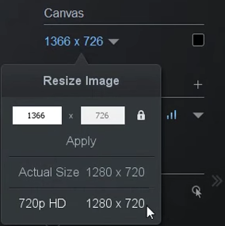
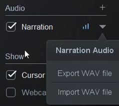
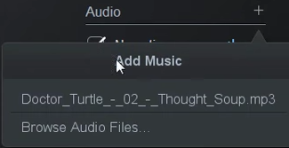
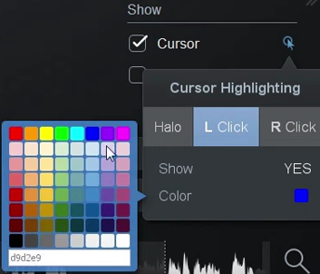
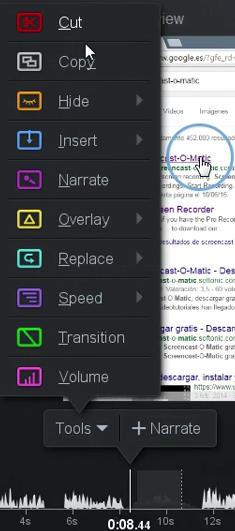

# Editando

Dentro de las posibilidades que ofrece la versión de pago de Screencast-o-matic está la de editar el vídeo resultante. Nos ofrece para esto una gran cantidad de herramientas.

En primer lugar, nos deja cambiar el tamaño del vídeo de manera manual, o cambiarlo a HD Ready de manera predefinida (1280p x 720p). También, en caso de que el marco sea más grande que el vídeo, nos deja darle un color de fondo.

Si hemos grabado el audio por separado, por ejemplo con una grabación guionizada con **Script Recording** o también si hemos grabado audio y vídeo a la vez, nos deja exportar el audio. Podemos exportar por un lado el lado audio del ordenador y por otro el de nuestra locución.

    

Ofrece la posibilidad de importar canciones para ponerlas de fondo. Lo mejor esta función es que nos hace las subidas de volumen y las bajadas automáticamente, adaptándose a sí hay locución o no.

También nos deja elegir si queremos que se vea el cursor o no, y en las opciones podemos configurar si queremos que el ratón tenga un círculo marcándolo, el color, si queremos que cambie cuando hagamos clic, etc.

Si hemos registrado la webcam en la fase de grabación podemos activarla o desactivarla. Esto incluso podemos hacerlo en momentos dados haciendo uso de las herramientas de edición.

Una vez en el timeline, el cual podemos agrandar o reducir para que sea más fácil la navegación, nos muestra la forma de onda de la narración. Así es muy fácil ver si en una sección dada tenemos audio o no. Resultará especialmente útil para todo el tema de transiciones, cortar, etc.

Sobre la cabeza lectora, la línea lectora que nos marca el punto de tiempo que previsualizamos en pantalla, tenemos un menú emergente con todas las herramientas:

- **Cut**: corta partes que no queramos en el vídeo. Corta tanto el audio como el vídeo.
- **Copy**: copia una parte del vídeo que luego podemos pegar con la herramienta **Insert**.
- **Hide**:  oculta el cursor o la webcam en un punto dado.
- **Insert**: nos deja poner en nuestro montaje una nueva grabación, una grabación que ya hayamos hecho o un trozo copiado con **Copy**. También con insert podemos hacer una pausa si vemos que algo nos ha quedado muy apresurado o tal vez queremos insertar un texto o una flecha en algún punto.
- **Narrate**: permite grabar una locución sobre el vídeo o una parte de ésta. Nos puede venir bien para importar un vídeo y darle una nueva locución a todo el vídeo o parte de él.
- **Overlay**: que permite insertar elementos sobre el vídeo, textos, imágenes, flechas... que son además talmente configurables.
- **Replace**: nos permite reemplazar un trozo del vídeo con una nueva grabación. Eso es muy útil que si nos hemos equivocado y también nos brinda la opción de congelar un fotograma.
- **Speed**: acelera o desacelera una parte del video. Esto es práctico en momentos donde hemos grabado un proceso, por ejemplo una barra de carga llenandose, y queremos que pase rápido.
- **Transitions**: hace transiciones por disolución, fundiendo una imagen con otra. Si la colocamos al inicio o al final hace fundidos a negro o desde negro.
- **Volume**: modifica el nivel de audio de la narración y del ordenador, cada uno por separado.
- **Zoom**: no está en la barra de herramientas, sino que lo activamos haciendo clic en la imagen. Nos aparecerá la barra de herramientas y un control en el timeline.

Una vez aplicados los efectos, sólo queda pulsar en el **Done** y **exportar** o **subir a internet** el vídeo final.

## ¿Quieres ver cómo se hace?

https://www.youtube.com/watch?v=oeS7k-QzvEs

