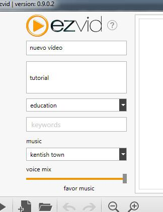
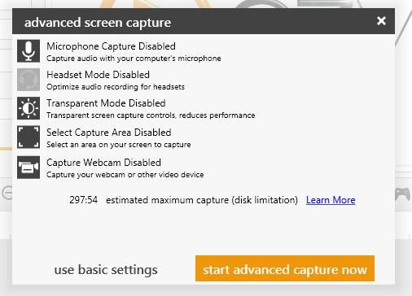
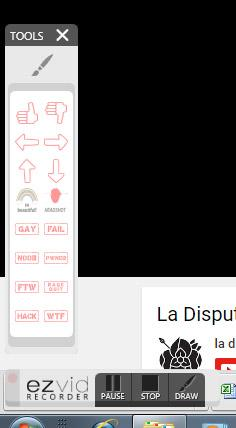

# Grabando

<meta content="text/html; charset=utf-8" http-equiv="content-type" />

Para empezar a grabar en EZvid lo primero que tenemos que hacer es nombrar nuestro archivo. Podemos también darle una descripción y etiquetas.

Ezvid no solo nos ofrece la posibilidad de grabar la pantalla, sino que nos brinda diferentes herramientas.

- Ayuda para captura de juegos
- Captura de Imagen
- Captura de voz (micrófono)
- Crear voz sintetizada
- Insertar texto
- Insertar vídeos o imágenes fijas

Para grabar la pantalla, pulsamos sobre Captura de imagen. Nos aparecerá una pantalla informativa indicándonos que se va a proceder a la captura de imagen y una estimación del tiempo total que podemos grabar en base a nuestro espacio libre en disco.

Podemos darle a grabar o pulsar abajo a la derecha, donde tenemos las opciones avanzadas. Aquí controlarás lo siguiente:

- Activar/desactivar micrófono durante la captura
- Activar/desactivar mejora de grabación de audio para micrófono de cascos
- Controles de captura transparentes (reducen el rendimiento del ordenador)
- Capturar una región/área (recorte)
- Captura de la webcam

Una vez le damos a grabar nos aparecen los controles de grabación: nos ofrece pausar/grabar, las herramientas de dibujo y detener. Este último botón nos devuelve a la ventana principal del programa y nos carga el vídeo en el timeline.

 

Algunas de las herramientas son un poco infantiles. Pero nos permite el trazo y las flechas, que son lo básico. Además de esas tenemos algunos símbolos, útiles de vez en cuando pero absurdos el resto del tiempo, pues pertenecen a la subcultura de Internet. Además están en inglés, con lo que no tienen mucho interés a la hora de crear vídeos educativos.

En cuanto a la grabación de voz, podemos hacerla directamente o grabarla una vez que hemos hecho el vídeo y lo hemos recortado a nuestro gusto.

En esta ocasión la mecánica es la contraria a la que veremos en Screencast-o-matic.

## ¿Quieres ver cómo se hace?

https://www.youtube.com/watch?v=eiJb-pZzgFs