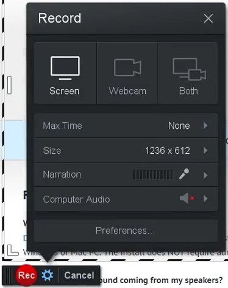
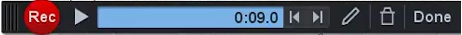
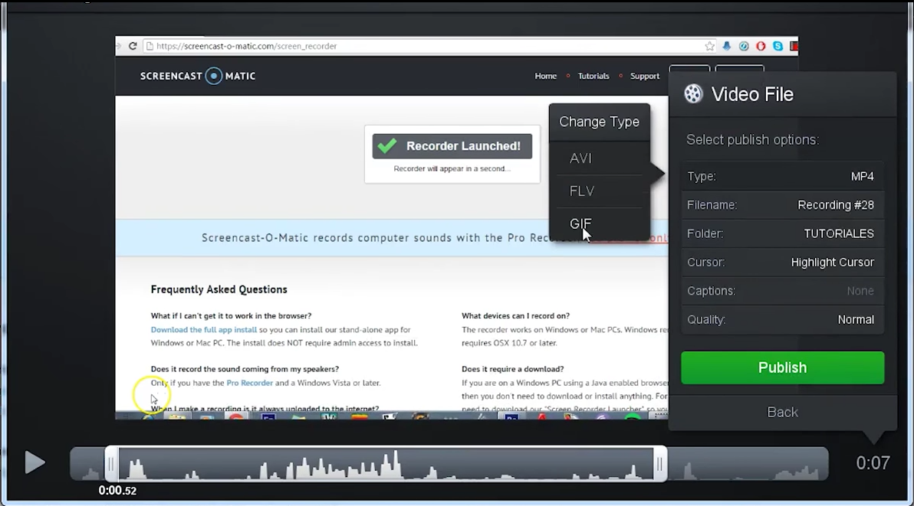

# Grabando

En Screencast-o-matic, como ya hemos comentado, que existen dos modos de uso:

- A través del explorador web, entrando en [www.screncast-o-matic.com](http://www.screncast-o-matic.com)
- Instalando el programa en nuestro ordenador.

Nada más acceder a la web oficial de Screencast-o-matic podemos pulsar sobre **Start Recording **y tras instalar un lanzador nos pide volver a la página oficial donde ya podríamos darle a grabar.

Al hacerlo se nos abre una nuevaventana donde nos ofrece en tres modos de grabacií³n:

- Pantalla
- Webcam
- Ambos

El recuadro de líneas blancas y negras marca la ventana de captura. Todo lo que esté fuera no será capturado. En la ventana de grabación, además, tenemos otros menús:

- El ****tiempo máximo****, que aunque en la imagen aparezca **None**, en la versión gratuita son sólo 15minutos.
- El tamaño en pixels (****Size****)de la captura en ancho por alto. En la versión gratuita nos ofrece las opciones degrabarlo en HD Ready a 720 pin en SD, 480p . El 480p sería ideal parapequeños vídeos. 720p es un formato de HD de alta definición pero no especialmente grande. En la versión de pago además nos ofrecen una grabación a la resolución nativa del monitor, la real de la pantalla.
- En ****Narration**** vemos el nivel de audio de la grabación. Las barras que se iluminan no deberían llegar al rojo en el micrófono. Si se ponen en rojo deberíamos alejarnos un poco del micrófono para que el audio se grabe correctamente. En este apartado podemos seleccionar la entrada de micro en caso de que tengamos más de uno disponible.
- En ****computer audio**** podemos activar o desactivar la grabación de los sonidos del ordenador, es decir, lo que sale por nuestros altavoces. Esta opción sólo está activa en ordenadores con sistema operativo windows desafortunadamente.
- Por último tenemos las ****preferencias**** donde nos muestra los atajos de teclado. Es interesante conocerlos, ya que nos permiten hacer capturas mucho más dinámicas. Cuando le damos a grabar, el cuadro blanco y negro cambia y se pone en rojo. Si estamos en la versión gratuita solo tendríamos el botón de grabar y de pausa. Sin embargo,en la versión de pago disponemos de más opciones y herramientas.

En esta versión, que es la de pago, vemos: el contador de tiempo de grabación, si el audio está o no conectado y las herramientas de dibujo.

- Las ****herramientas de dibujo** **cuentan con los siguientes elementos: trazado o línea libre; línea recta, flechas... cajas o recuadros, óvalos y subrayados. Además de esto tenemos el borrador y un selector de colores donde tenemos una amplia gama.

- Respecto al ****zoom****, se activa haciendo doble clic y se desactiva haciendo clic+Ctrl en Windows o clic + comando cmd en Macintosh. En la versión de pago podemos además pausar y volver atrás.Esto no sirve para grabar encima, lo cual nos ahorra mucho tiempo si te has equivocado, si quieres corregir un error o insertar algo en un momento en tu vídeo.

Una vez terminada la grabación nos devuelve la siguiente pantalla. La versión gratuita apenas nos deja hacer nada más que recortar el inicio y final con los controles de la línea de tiempo. Por otro, lado también pues podríamos guardar el archivo en nuestro disco duro o subirlo a la web.

La versión de pago, que cuesta 15 dólares, como unos 10 euros, ofrece una gran cantidad de posibilidades de edición de video: como insertor de transiciones, de efectos, cortés, aceleraciones... La verdad es que tiene muchas herramientas para hacer un tutorial y además nos ofrece la posibilidad de subirlo a internet, preparando el vídeo para distintos formatos (Google Drive, Vimeo, Youtube...). Todas estas posibilidades de edición de la versión de pago las veremos a continuación.

## ¿Quieres ver cómo se hace?

<iframe width="100%" height="350" src="//www.youtube.com/embed/ztbt1gSyfjA?rel=0" frameborder="0"></iframe>

