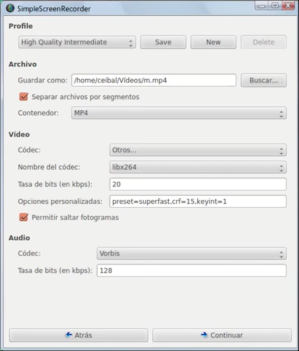
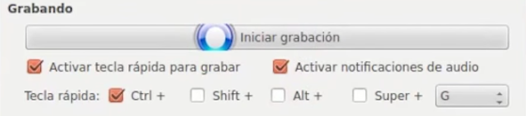

# Grabando

Una vez abierto lo primero que vemos es que podemos hacernos un perfil para guardar nuestra configuración y así recuperarla fácilmente. Entre las opciones de grabación que nos aparecen son:

- Pantalla completa.
- Grabar un rectángulo.
- Seguir el cursor
- Grabar OpenGL, que es sobre todo para juegos.

Podemos configurar tanto la base de **fotogramas por segundo** (tasa de fotogramas), como el **tamaño resultante** del vídeo (en escalar vídeo).

La **entrada de audio** es también configurable, pudiendo seleccionar la entrada que queramos. La configuración que yo recomendaría para no complicarse sería:  sistema **ALSA** y en fuente el que ponga **Analog** o analógicas.

Cuando clicamos en C**ontinuar** se nos abre un menú en el que podemos seleccionar el nombre de archivo resultante y en qué formato queremos que se grabe. Volvemos a darle a continuar y vemos que, además de grabar con el botón de **Iniciar grabación**, podemos configurar el atajo de teclado que activa la grabación.

Tenemos también un botón de vista previa para comprobar que toda nuestra configuración funciona cómo queremos. Podemos visualizar tanto el vídeo como comprobar el nivel de entrada del micrófono. Con esto pues ya podríamos grabar normalmente.

SimpleScreenRecorder no tiene opciones de edición por lo que tendríamos que utilizar un programa adicional para recortar o para unir diferentes grabaciones en un solo vídeo.

## ¿Quieres ver cómo se hace?

<iframe width="100%" height="350" src="//www.youtube.com/embed/06OV5IcYZWo?rel=0" frameborder="0"></iframe>

