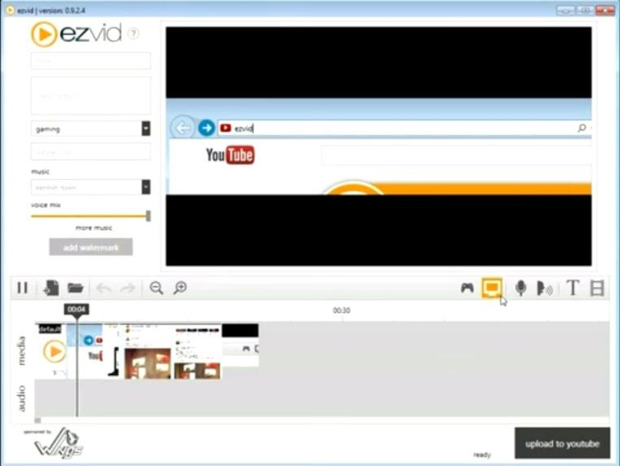
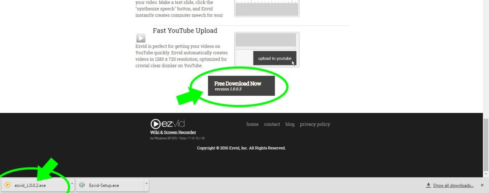
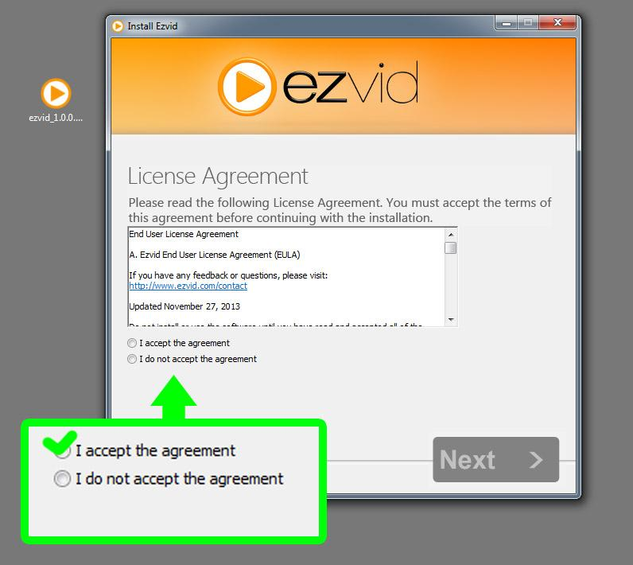
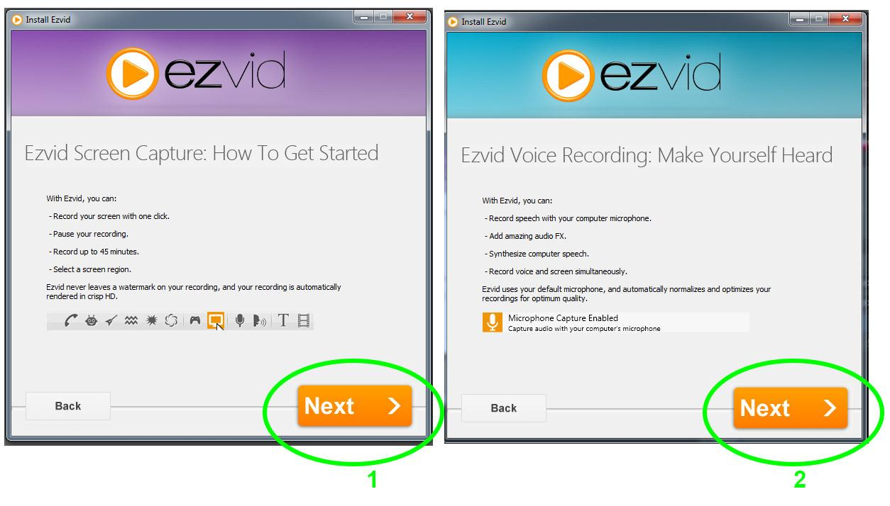
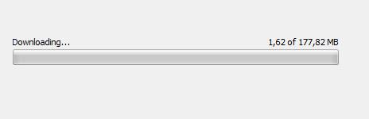
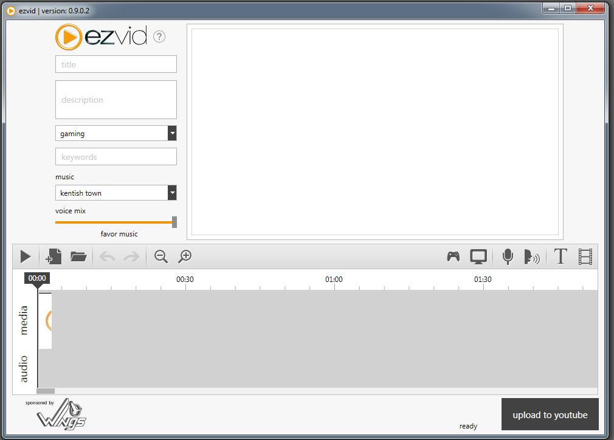

# Ezvid

Ezvid es otra potente herramienta gratuita para capturar la pantalla de nuestro ordenador. Puede grabar hasta 45 minutos en una sola captura en formato HD (HDReady optimizado para su subida a Youtube) y soporta recortes de regiones de la pantalla. Lo mejor de todo es que no deja ninguna molesta marca de agua en el archivo resultante.

Respecto al audio, soporta grabar desde la entrada de micro. Además normaliza automáticamente la señal (iguala el volumen para que no haya molestas subidas o bajadas de nivel durante la captura) y la optimiza para una óptima calidad. Puede también añadir efectos de sonido e incluso crear una voz sintetizada a partir de una archivo de texto.

- Instalar Ezvid es tan sencillo como ir a la página oficial [www.ezvid.com](https://www.google.com/url?q=http://www.ezvid.com&amp;sa=D&amp;ust=1473068081683000&amp;usg=AFQjCNH7Irw5jerJjvjGxQDreSVvVyBtfQ)  y pulsar sobre Free Screen Recorder. 

- En la nueva página que se nos abre hacemos scroll hasta el final de la pantalla. Allí veremos Free Download Now. Pulsamos y se nos descarga el instalador. Encontraremos un archivo llamado Ezvid_1.0.0.2.exe (el número representa la versión, por lo que si la actualizan puede variar ligeramente) en nuestra carpeta de descargas del explorador de Internet. Hacemos doble click para instalarlo.

- Aceptamos los términos de uso.

- Seguimos los pasos dándole a Siguiente y cuando termine de rellenarse la barra de descarga tendremos Ezvid instalado en nuestro ordenador.

- El Interfaz gráfico de Ezvid es es siguiente:

 

## ¿Quieres ver cómo se hace?

https://www.youtube.com/watch?v=X8K4Vo7UyWo

