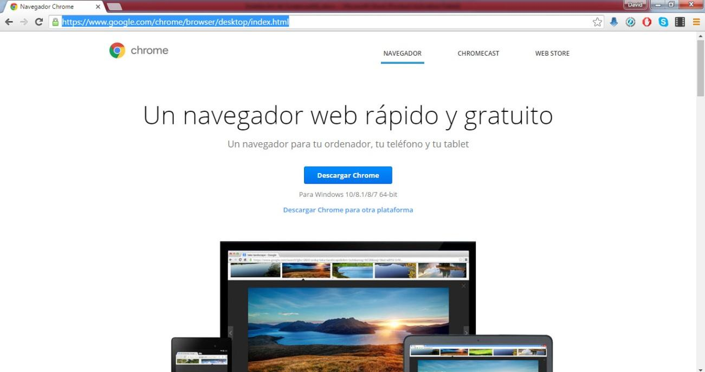
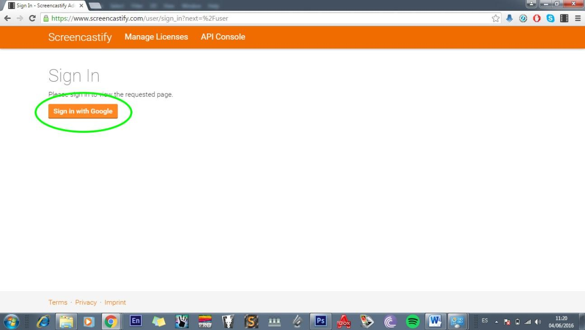
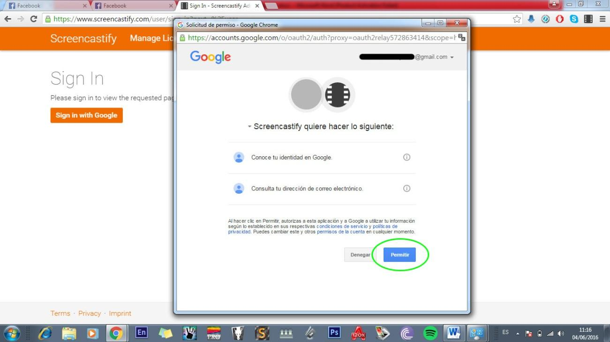
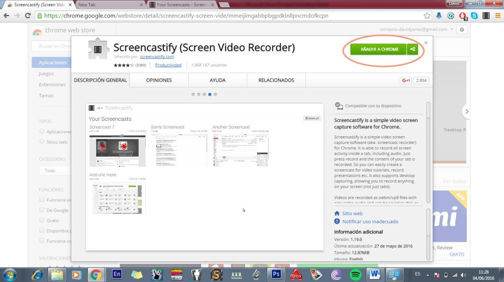
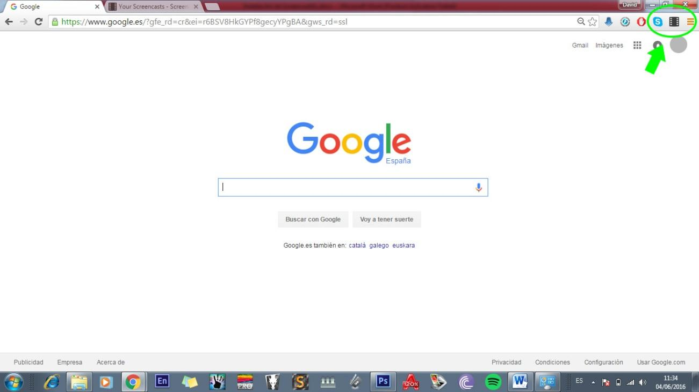

# Screencastify

<meta content="text/html; charset=utf-8" http-equiv="content-type" />

- Necesitamos tener instalado el explorador de Internet Chrome.

- Si no lo tenemos, usando nuestro explorador habitual (bien sea Internet Explorer, Mozilla, Opera o cualquier otro) iremos a la dirección  
[https://www.google.com/chrome/browser/desktop/index.html](https://www.google.com/url?q=https://www.google.com/chrome/browser/desktop/index.html&amp;sa=D&amp;ust=1473070273181000&amp;usg=AFQjCNFVzrdfxczHaKKlSpaNFsNAnYMg4A)

- Pulsaremos descargar Chrome y seguiremos los pasos hasta completar la instalación.

- Una vez tengamos instalado Google Chrome iremos a la dirección [https://www.screencastify.com/](https://www.google.com/url?q=https://www.screencastify.com/&amp;sa=D&amp;ust=1473070273182000&amp;usg=AFQjCNEm9Y-Fjd9UKIrwB3c50zrBFIDsbg)
- Allí tendremos que pulsar sobre "sign in with google", es decir que nos tenemos que [registrar con una cuenta de gmail](http://es.wikieducator.org/Google_drive/Primeros_pasos#Creando_una_cuenta_de_Google). 

- Cuando nos registramos en la web de screencastify, nos saldrá un mensaje de información donde nos pide permiso para conocer nuestra identidad de google y acceder a nuestra cuenta de correo. le damos a Permitir.

- De ahí nos llevará a la chrome web store. Aunque también podríamos acceder directamente al website de chrome web store: [https://chrome.google.com/webstore](https://www.google.com/url?q=https://chrome.google.com/webstore&amp;sa=D&amp;ust=1473070273188000&amp;usg=AFQjCNHoZY1im4MImvMHj1dyIGEBNr1HEA)

- Allí le daremos a "añadir a chrome". Esto nos instalará el complemento en nuestro explorador Chrome. A partir de entonces tendremos un icono de un fotograma en la parte superior derecha de la ventana del explorador.

- Pulsando sobre el icono abriremos la ventana de capturar pantalla

## ¿Quieres ver cómo se hace?

https://www.youtube.com/watch?v=da45tN9uhfw