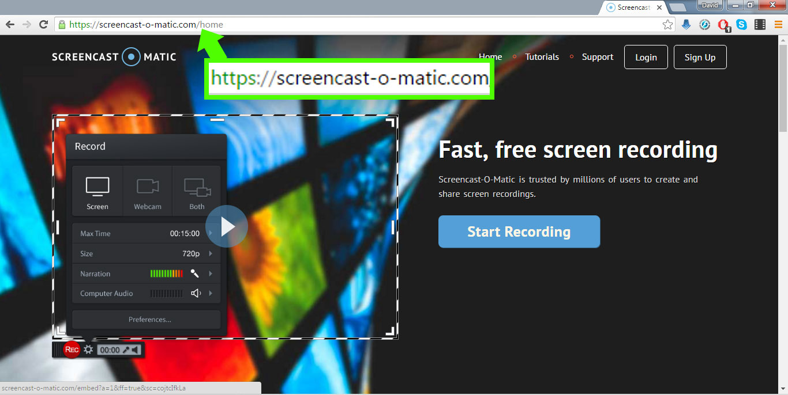
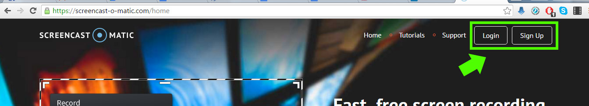
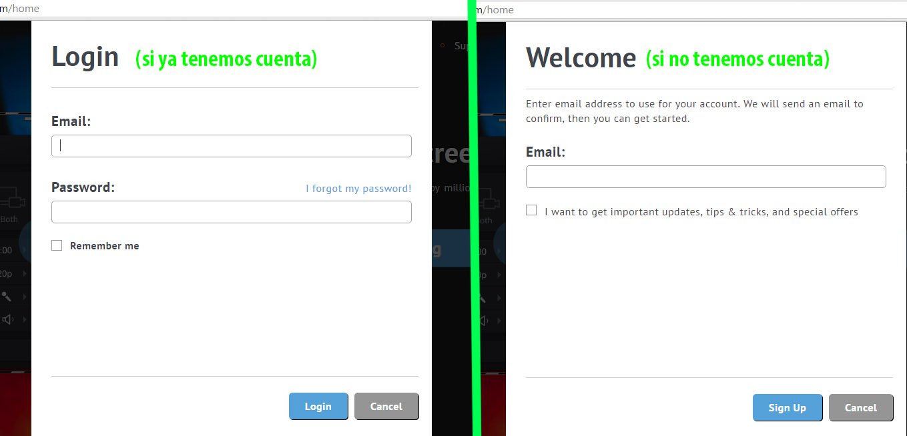
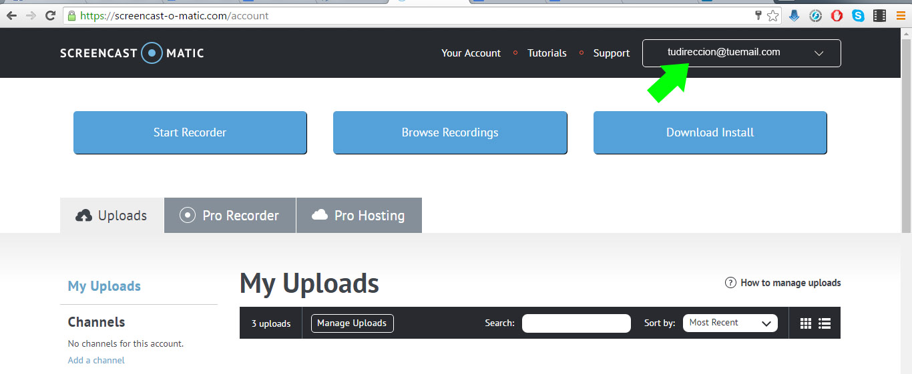
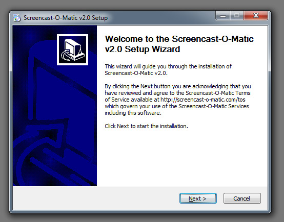
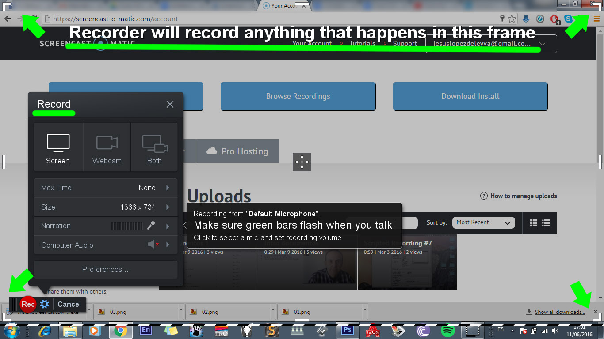

# Screencast-o-matic

<li dir="ltr">
Podemos acceder a Screencast-o-matic desde nuestro explorador de Internet. El acceso a la aplicación se realiza a través del sitio web [http://www.screencast-o-matic.com/](http://www.screencast-o-matic.com/).
</li>

<li dir="ltr">
Una vez en el site, se recomienda crear una cuenta de usuario, es decir registrarse. Para ello necesitamos una cuenta de correo. En caso de ya tener una cuenta creada tendríamos que identificarnos. En cualquiera de los dos casos se ha de hacer clic sobre el icono login de la esquina superior derecha.
</li>

<li dir="ltr">
Aparecerá una ventana similar a la siguiente usa la opción Login si ya eres un usuario registrado o crea una cuenta nueva rellenando los campos del formulario Register.
</li>

<li dir="ltr">
Una vez que estamos registrados y/o identificados en el sistema, aparecerá nuestra dirección mail en la parte superior derecha del sitio.
</li>

<li dir="ltr">
En esa ventana nos da 3 opciones. Empezar a grabar usando la aplicación web, ver nuestras grabaciones anteriores (si las hubiese) o descargar la aplicación de escritorio.
</li>
<li dir="ltr">
Para un uso continuado lo ideal es descargar la aplicación de escritorio.
</li>
<li dir="ltr">
Si le damos a descargar se nos guardará el instalador en la carpeta de descargas de nuestro explorador de archivos.
</li>

Para un uso continuado lo ideal es descargar la aplicación de escritorio.

<li dir="ltr">
Haciendo doble click sobre el archivo que hemos descargado  (InstallScreencastOMatic-2.0.exe en Windows o InstallScreencastOMatic-2.0.dmg en MacOs) podremos instalar la aplicación.
</li>

<li dir="ltr">
Una vez instalado, cuando arrancamos el programa veremos este interfaz.
</li>

<li dir="ltr">
Si sólo queremos utilizar Screencast-o-matic de una manera puntual, lo ideal es usar la aplicación web. Pulsando el botón de start recorder se nos abrirá la aplicación y podremos empezar inmediatamente a grabar todo lo que esté dentro del recuadro.
</li>

## ¿Quieres ver cómo se hace?

https://www.youtube.com/watch?v=tgM-WXSZ5IM

