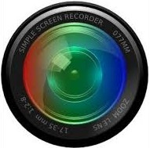

# SimpleScreenRecorder

Entre las varias opciones que tenemos para grabar el escritorio en **Linux** encontramos SimpleScreenRecorder. También posee la **opción de seguir ratón**.****

Características notables de la aplicación son

- **Registra toda la pantalla** o **aplicaciones [OpenGL](https://es.wikipedia.org/wiki/OpenGL)** directamente.
- **Mantiene audio y vídeo sincronizados**.
- **Reduce automáticamente la velocidad de fotogramas** para ordenadores lentos.
- Es una **aplicación multihilo**, lo cual quiere decir que cuanto más potente es el ordenador, mejor rendimiento y mejor calidad tendrá el vídeo. Si tenemos un ordenador un poco más antiguo o menos potente se adaptará para obtener un vídeo de buena calidad y que no tengamos se saltos o desincronía entre el audio y el vídeo.
- Podemos **escalar el vídeo resultante**, es decir, podemos estar grabando una pantalla con una resolución muy alta y escalarla para 720 p, formato de alta definición para internet.

Para instalarlo, a través del **Centro de Software**, buscamos SimpleScreenRecorder. Una vez que la encontramos le damos a instalar y listo. Ya solo tendríamos que buscarlo en A**plicaciones** - **Sonido y Vídeo - SimpleScreenRecorder**.

Podemos ver más opciones de instalación en la web oficial del programa: [http://www.maartenbaert.be/simplescreenrecorder/](http://www.maartenbaert.be/simplescreenrecorder/)

## ¿Quieres ver cómo se hace?

<iframe width="100%" height="350" src="//www.youtube.com/embed/DSBXuWAltfM?rel=0" frameborder="0"></iframe>

