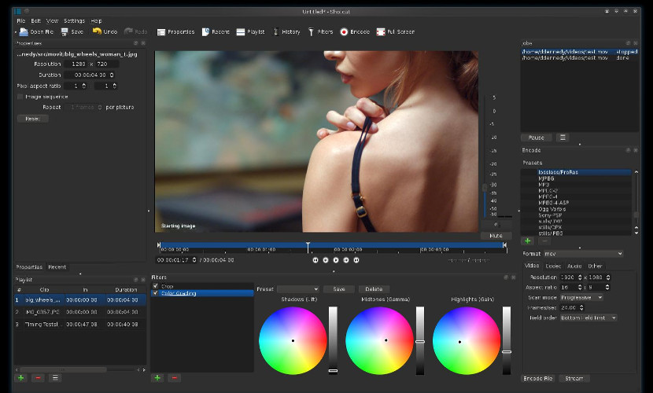

# Shotcut

## Conocimiento previo

Normalmente, aunque existen muchos programas de Software Libre, muchos usuarios suelen preferir las opciones privativas por funcionar mejor que los programas libres. Es el caso de muchos que usan editor de video, el cuál prefieren usar una solución privativa a una solución libre. Por ello hoy os hablamos de **Shotcut, un editor de video multiplataforma** que poco a poco se está consolidando como una gran alternativa, no sólo para Ubuntu sino para otros sistemas operativos.

Shotcut es un programa que en las últimas versiones ha incluido soporte no sólo para la inmensa mayoría de formatos de video y audio sino también para vídeos con resolución 4K. Con este editor de video la **edición de video 4K** será más fácil que con otros programas.

Pero el 4K no es la única virtud de este editor de video, la captura de video es otra de las virtudes ya que no sólo **permitirá importar vídeos de otros medios** sino que también podremos **capturar video de nuestro escritorio** y también de nuestra webcam, algo que agilizará mucho el trabajo de edición de video.

Y al igual que otros muchos editores de video privativos, **este programa contiene muchos filtros** y cada vez más que nos ayudará a crear videos profesionales con poco esfuerzo. Y continuando con esta filosofía profesional, este programa contiene muchos lenguajes que permitirá que el programa pueda utilizarse con cualquier persona **sin problema de idioma**. Y a diferencia de otros muchos programas, este editor de video tiene [una web](http://www.shotcut.org/bin/view/Shotcut/WebHome) con formación sobre el programa que hará que cualquier novato pueda usar este editor de video y obtenga resultados muy buenos, siempre con este programa.

Fuente del texto y la imagen: [ubunlog.com](http://ubunlog.com/shotcut-un-impresionante-editor-de-video/)

