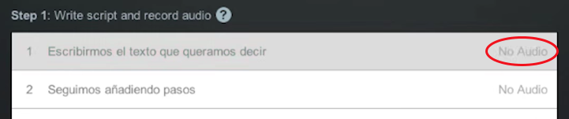

# Scripted Recording

En este apartado vamos a ver cómo funciona en screencast-o-matic la función avanzada de grabar vídeos con guión,  llamada ****Scripted.**** Esta función no está disponible en la versión gratuita desafortunadamente, pero si vamos a crear tutoriales de manera continua, este programa es una gran baza, ya que es muy potente y, por suerte, muy económico.

Una vez arrancamos el programa, además de la función de grabación que ya hemos visto, podemos pulsar sobre **Scripted**. Allí vemos la siguiente interfaz:

En cada una de las barras podemos insertar texto, bien de manera manual o bien pegándolos desde un archivo de texto que hayamos escrito previamente. Cada acción debería estar en una barra para que no sea fácil después hacer los vídeos. Una vez que tenemos todos los pasos por escrito procederemos a grabar el audio de nuestro video-tutorial.

A la derecha de las barras podemos ver que dice **No Audio. **Pulsaremos en la primera línea para empezar desde ahí a grabarlas todas. Ahora, junto al botón rojo de **Rec** nos indica que grabaremos de la 1 en adelante. Al inicio está en rojo  para indicar que tenemos que esperar. Cuando esté en verde podremos ya grabar. Si nos equivocamos o no nos gusta la grabación pulsaremos **Redo** para repetirla y, si nos gusta, pasaremos a la siguiente pulsando en **Next**.

      

Una vez que hemos grabado todas, pasamos a grabar el vídeo. Esto nos abre el interfaz de grabación que es casi igual  que el que ya conocemos. La novedad es que nos reproduce el audio mientras nos muestra el texto de cada barra. Cuando terminemos de grabar el vídeo de un paso, podemos pasar al siguiente pulsando **Alt+N** en PC y **Opción+N** en Mac. Si nos equivocamos podemos pausar la grabación y desplazarnos hasta el punto en que queremos volver a grabar bien de manera manual o bien con los controles. Si tardamos en grabar el vídeo más tiempo de lo que dura el audio, no pasa nada, Screencast-o-matic rellena con silencio el resto de la sección.

Una vez hayamos terminado de grabar todos los pasos y tengamos el vídeo completo pulsaremos ****Done**** y volveremos a la pantalla anterior. Las barras aparecen ahora con más opciones. Entre ellas, una muy interesante es la de los fragmentos de vídeo que no tienen audio. Para hacer esto nos ofrece tres opciones:

- **Absorber silencio**: él vídeo entero de esa sección va más rápido para que dure lo mismo que el audio.
- **Cortar silencio**.
- **Acelerar silencio**: hace que la parte en silencio el video vaya más rápido. Esto además lo podemos aplicar varias veces para ir subiendo la velocidad.

Una vez ajustado esto pulsaríamos sobre ****Edit Video**** para pasar a la ventana de edición. Ésta funciona de la misma manera que hemos explicado en el apartado anterior.

## ¿Quieres ver cómo se hace?

https://www.youtube.com/watch?v=0DdqSlj7K7A

